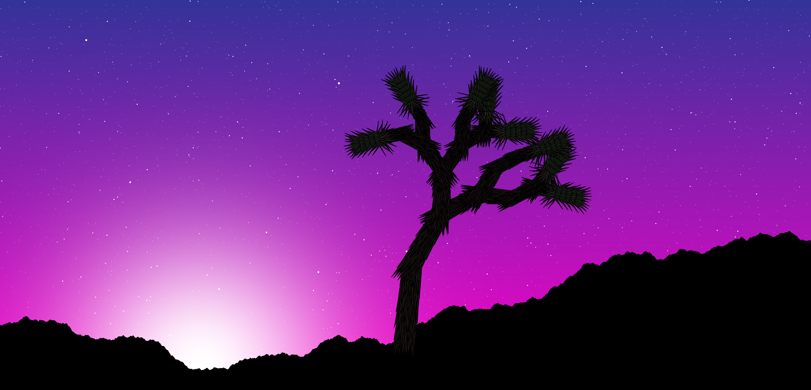

# Interactive Joshua Tree scene generator in Javascript + p5.js

This is a Javascript + p5.js port of my [fractal-joshua-trees](https://github.com/beyondbeneath/fractal-joshua-trees) routines (Python + matplotlib). Almost everything is exactly the same, so all the documentation there, including detailed parameter descriptions, is valid here. This is the first thing I have ever written in Javascript, so no doubt best coding practice has not been adhered to!

To see this in action, checkout the live demo here.

## Acknowlegements

This makes heavy use of:

* [p5.js](https://p5js.org/)
* [dat.gui](https://github.com/dataarts/dat.gui)